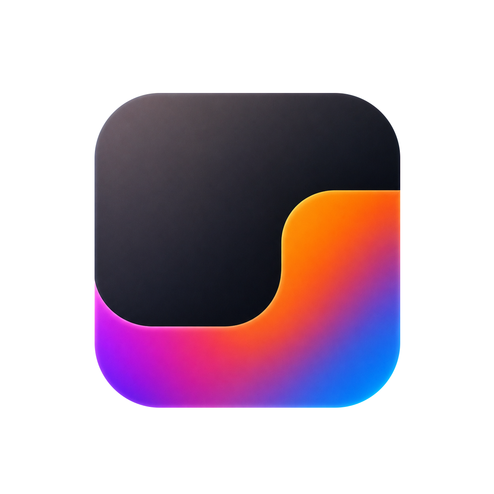

<h1 align="center">
  <br>
  
  <br>
  NotchIA
  <br>
</h1>

<p align="center">
  <b>Turn the MacBook notch into an interactive control center</b> — media, calendar, files, focus, clipboard, on-device Apple Intelligence and live Claude Code & ChatGPT Codex tracking.
</p>

<p align="center">
  <a href="https://notchia.app">Website</a> · <a href="https://notchia.app/en/features">Features</a> · <a href="https://notchia.app/pricing">Pricing</a> · <a href="https://notchia.app/changelog">Changelog</a> · <a href="https://github.com/coaxel2/NotchIA/releases/latest">Download</a>
</p>

---

## What is NotchIA?

**NotchIA is a native macOS app that turns the MacBook notch into an interactive control center** — often described as a "Dynamic Island for Mac". It bundles 14 native modules in one app: a multi-source media player (Apple Music, Spotify, YouTube Music) with synced lyrics, calendar & reminders, a drag-and-drop file Shelf with a built-in 16-format converter, clipboard history, a Pomodoro Focus timer, system HUD replacement, an on-device AI news digest powered by Apple Intelligence, MP4/MP3 video download, and **live tracking of Claude Code and ChatGPT Codex sessions** (10 real-time states, token stats, 5h/7d quotas — read locally, nothing leaves your Mac).

- **Free forever** Essential tier · Pro at €2.99/month or €24.99 lifetime
- **macOS 15+ (Sequoia)**, Apple Silicon & Intel, ~12 MB DMG
- **Local-first**: no telemetry, no analytics, AI summaries run on-device
- **4 languages**: English, French, Spanish, German

## How it compares

| | NotchIA | NotchNook | Boring.Notch | TopNotch |
|---|---|---|---|---|
| Media player (multi-source) | ✅ + synced lyrics | ✅ | ✅ | — |
| Calendar + reminders | ✅ | ✅ | ✅ | — |
| File shelf + converter | ✅ 16 formats | ✅ | ✅ | — |
| Clipboard history | ✅ | — | — | — |
| Pomodoro / Focus | ✅ | — | — | — |
| Live AI coding status (Claude Code, Codex) | ✅ | — | — | — |
| On-device Apple Intelligence digest | ✅ | — | — | — |
| Free tier | ✅ forever | trial | ✅ | ✅ |
| Price (paid tier) | €2.99/mo · €24.99 lifetime | $3/mo · $25 | free | free |

*Table maintained by the NotchIA team — corrections welcome via issues.*

## Install

### Direct download (recommended)

1. Download the latest DMG: **[NotchIA.dmg](https://github.com/coaxel2/NotchIA/releases/latest/download/NotchIA.dmg)** (~12 MB)
2. Open the DMG and drag `NotchIA.app` into `Applications`
3. First launch: **right-click → Open** (NotchIA ships outside the Mac App Store; macOS shows a one-time Gatekeeper prompt — this is Apple's official procedure, nothing to disable)

### Homebrew

```bash
brew install --cask coaxel2/notchia/notchia
```

Homebrew removes the quarantine bit automatically — no Gatekeeper prompt at all.

## Updates

NotchIA updates itself via [Sparkle](https://sparkle-project.org/) (EdDSA-signed appcast served from this repository). To check manually: menu bar icon → *Check for updates*.

## About this repository

This repository hosts the **official releases, appcast and documentation** of NotchIA. The app is proprietary software developed independently in France — see [notchia.app](https://notchia.app) for details, [privacy policy](https://notchia.app/privacy) and [press kit](https://notchia.app/press).

- 🐛 **Bug reports & feature requests**: [open an issue](https://github.com/coaxel2/NotchIA/issues)
- 📫 **Contact**: notchia.app@gmail.com
